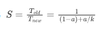

# 第 1 章：计算机系统漫游 - 详细总结

## 1.1 核心观点

计算机系统是由**硬件**和**系统软件**组成的，它们共同协作来运行**应用程序**。

## 1.2 信息就是位 + 上下文

*   系统中所有的信息（包括磁盘文件、内存中的程序、用户数据、网络数据）都是由一串**比特（bits）** 表示的。
*   区分不同数据对象（如整数、浮点数、字符串、指令）的唯一方法是读取这些数据时的**上下文(content)**。
*   只由 ASCII 字符构成的文件称为**文本文件**，其他所有文件都称为**二进制文件**。

## 1.3 程序被翻译成不同的格式

一个 C 程序从源代码到可执行文件需要经历四个阶段，由**编译系统（compilation system）** 完成：

| 阶段       | 执行程序 | 输入          | 输出      | 描述                                                                         |
| :--------- | :------- | :------------ | :-------- | :--------------------------------------------------------------------------- |
| **预处理** | `cpp`    | `hello.c`     | `hello.i` | 处理以 `#` 开头的命令（如 `#include`），将头文件内容直接插入源文本。         |
| **编译**   | `ccl`    | `hello.i`     | `hello.s` | 将高级语言翻译成**汇编语言**文本文件。                                       |
| **汇编**   | `as`     | `hello.s`     | `hello.o` | 将汇编语言翻译成**机器语言指令**，打包成**可重定位目标程序**（二进制文件）。 |
| **链接**   | `ld`     | `hello.o` ... | `hello`   | 将预编译好的目标文件（如 `printf.o`）合并到程序中，生成**可执行目标文件**。  |

**了解编译系统的好处：**
*   **优化程序性能**：理解机器代码和编译器的转化方式，有助于做出更好的编码选择。
*   **理解链接错误**：帮助诊断和解决构建大型软件时的链接问题。
*   **避免安全漏洞**：理解数据和控制信息在栈上的存储方式，是避免缓冲区溢出攻击的第一步。

## 1.4 处理器读取并解释内存中的指令

### 1.4.1 系统的硬件组成

一个典型系统的硬件由以下部分组成：

1.  **总线**：贯穿整个系统的电子管道，携带信息字节并在部件间传递。通常传送定长的字节块（字，word）。
2.  **I/O 设备**：系统与外部世界的通道（如键盘、鼠标、显示器、磁盘）。每个 I/O 设备都通过**控制器**或**适配器**与 I/O 总线相连。
3.  **主存**：临时存储设备，处理器执行程序时存放程序和程序处理的数据。从逻辑上看，它是一个线性的字节数组，每个字节都有唯一的地址。
4.  **处理器（CPU）**：解释（或执行）存储在主存中指令的引擎。其核心是**程序计数器（PC）**，任何时候都指向主存中的某条机器语言指令。
    *   **指令集架构**：描述每条机器代码指令的效果。
    *   **微体系结构**：描述处理器实际上是如何实现的。
    *   **基本操作**：加载、存储、操作、跳转。

### 1.4.2 运行 hello 程序

1.  **输入指令**：Shell 程序等待用户输入，将字符串 `"./hello"` 读入寄存器，再存至内存。
2.  **加载程序**：Shell 执行指令，通过 **DMA（直接存储器存取）** 技术将可执行文件 `hello` 中的代码和数据从磁盘复制到主存。
3.  **执行程序**：处理器开始执行 `main` 程序中的机器指令，将 `"hello, world\n"` 字符串从主存复制到**寄存器文件**，再从寄存器文件复制到**显示设备**。

## 1.5 高速缓存至关重要

*   **问题**：系统花费大量时间在存储设备间移动信息。较大较慢的存储设备（如磁盘）与较小较快的设备（如寄存器）之间存在巨大的速度差距。
*   **解决方案**：采用**高速缓存存储器（Cache）** 作为暂时的集结区域，存放处理器近期可能会需要的信息。
*   **局部性原理**：程序具有访问局部区域里的数据和代码的趋势。
*   **层次**：通常有多级高速缓存（L1, L2, L3），L1 最快最小（在处理器芯片上），L3 最慢最大（在芯片外）。

## 1.6 存储设备形成层次结构

存储器层次结构的主要思想是：**上一层的存储器作为低一层存储器的高速缓存**。

| 层级 | 名称         | 描述                           | 特点                         |
| :--- | :----------- | :----------------------------- | :--------------------------- |
| L0   | 寄存器       | CPU 内部                       | 速度最快，成本最高，容量最小 |
| L1   | L1 高速缓存  | （SRAM）位于 CPU 芯片上        |                              |
| L2   | L2 高速缓存  | （SRAM）通过特殊总线连接至 CPU |                              |
| L3   | L3 高速缓存  | （SRAM）                       |                              |
| L4   | 主存         | （DRAM）                       |                              |
| L5   | 本地二级存储 | 本地磁盘                       | 速度最慢，成本最低，容量最大 |
| L6   | 远程二级存储 | 分布式文件系统、Web 服务器     |                              |

## 1.7 操作系统管理硬件

操作系统是应用程序和硬件之间的一层软件，有两个基本功能：
1.  防止硬件被失控的应用程序滥用。
2.  向应用程序提供简单一致的机制来控制复杂多样的低级硬件设备。

操作系统通过三个基本抽象来实现这两个功能：

### 1.7.1 进程

*   **定义**：操作系统对一个正在运行的程序的一种抽象。
*   **并发**：一个进程的指令和另一个进程的指令是交错执行的。
*   **上下文切换**：操作系统实现进程交错执行的机制。它保存当前进程的**上下文**（PC、寄存器值、主存内容等），恢复新进程的上下文，然后将控制权传递给新进程。
*   **内核**：操作系统代码常驻主存的部分，是系统管理全部进程所用代码和数据结构的集合，并非一个独立进程。

### 1.7.2 线程

*   一个进程可以由多个称为**线程**的执行单元组成。
*   每个线程都运行在进程的上下文中，并**共享同样的代码和全局数据**。
*   多线程之间比多进程之间更容易共享数据，且更高效。

### 1.7.3 虚拟内存

*   **定义**：为每个进程提供一个假象，即每个进程都在独占地使用主存。
*   **虚拟地址空间**：每个进程看到的一致的内存视图。Linux 进程的虚拟地址空间包括以下区域（从低地址到高地址）：
    *   **程序代码和数据**：按照可执行文件内容初始化。
    *   **堆**：可在运行时动态扩展和收缩（如 `malloc`, `free`）。
    *   **共享库**：存放像 C 标准库这样的共享库的代码和数据。
    *   **栈**：编译器用于实现函数调用，可在执行期间动态扩展和收缩。
    *   **内核虚拟内存**：为内核保留，应用程序无法直接访问。

虚拟内存不只是用磁盘空间来扩展物理内存以使其包含硬盘驱动器而已。把内存扩展到磁盘只是使用虚拟内存技术的一个结果。除了扩展内存空间，虚拟内存技术还有隔离运行内存和确定运行地址的作用。

使用虚拟内存主要是基于以下三个方面考虑，也就是说虚拟内存主要有三个作用：

作为缓存工具，提高内存利用率：使用 DRAM 当做部分的虚拟地址空间的缓存（虚拟内存就是存储在磁盘上的 N 个连续字节的数组，数组的部分内容会缓存在 DRAM 中）。扩大了内存空间，当发生缺页异常时，将会把内存和磁盘中的数据进行置换。

作为内存管理工具，简化内存管理：每个进程都有统一的线性地址空间（但实际上在物理内存中可能是间隔、支离破碎的），在内存分配中没有太多限制，每个虚拟页都可以被映射到任何的物理页上。这样也带来一个好处，如果两个进程间有共享的数据，那么直接指向同一个物理页即可。

作为内存保护工具，隔离地址空间：进程之间不会相互影响；用户程序不能访问内核信息和代码。页表中的每个条目的高位部分是表示权限的位，MMU 可以通过检查这些位来进行权限控制（读、写、执行）。

### 1.7.4 文件

*   **定义**：文件就是字节序列。
*   **重要性**：所有 I/O 设备（包括磁盘、键盘、显示器、网络）都可以被视为文件。系统中的所有输入输出都是通过一小组称为 **Unix I/O** 的系统函数调用读写文件来实现的。
*   **统一视图**：文件向应用程序提供了一个统一的视图，来看待系统中可能含有的所有各式各样的 I/O 设备。

## 1.8 系统之间利用网络通信

*   网络可以视为一种 **I/O 设备**。
*   当系统从主存复制一串字节到网络适配器时，数据流经过网络到达另一台机器。

## 1.9 并发与并行

### 1.9.1 Amdahl 定律

*   **核心思想**：当我们对系统的某个部分加速时，其对系统整体性能的影响取决于该部分的重要性和加速程度。
*   **公式**：
    *   加速比 
    *   其中 $a$ 为部分比例，$k$ 为该部分性能提升比例。
*   **结论**：要想显著加速整个系统，必须提升全系统中相当大的部分的速度。

### 1.9.2 并发和并行

*   **并发（Concurrency）**：一个同时具有多个活动的系统。
*   **并行（Parallelism）**：用并发来使一个系统运行得更快。
*   并行可以在计算机系统的多个抽象层次上运用：
    1.  **线程级并发**：
        *   **单处理器系统**：通过时间共享模拟并发。
        *   **多处理器系统**：由单个操作系统内核控制的多处理器系统。
        *   **多核处理器**：将多个 CPU（核）集成到一个集成电路芯片上。
        *   **超线程（同时多线程）**：允许一个 CPU 执行多个控制流，更好地利用处理资源。
    2.  **指令级并行**：现代处理器可以同时执行多条指令（每个时钟周期 2~4 条）。
        *   **流水线（Pipelining）**：将指令执行划分成步骤，不同步骤并行处理不同指令。
        *   **超标量（Superscalar）**：处理器可以达到比一个周期一条指令更快的执行速率。
    3.  **单指令、多数据（SIMD）并行**：一条指令产生多个可以并行执行的操作，用于提高处理影像、声音和视频数据应用的执行速度。

### 1.9.3 抽象的重要性

抽象是计算机科学中最重要的概念之一。计算机系统提供了多个层次的抽象来隐藏实现的复杂性：

| 抽象           | 隐藏的细节                         |
| :------------- | :--------------------------------- |
| **文件**       | I/O 设备的细节                     |
| **虚拟内存**   | 主存和磁盘的细节                   |
| **进程**       | 处理器、主存和 I/O 设备的细节      |
| **虚拟机**     | 整个计算机（操作系统、硬件）的细节 |
| **指令集架构** | 实际处理器硬件的复杂性             |
